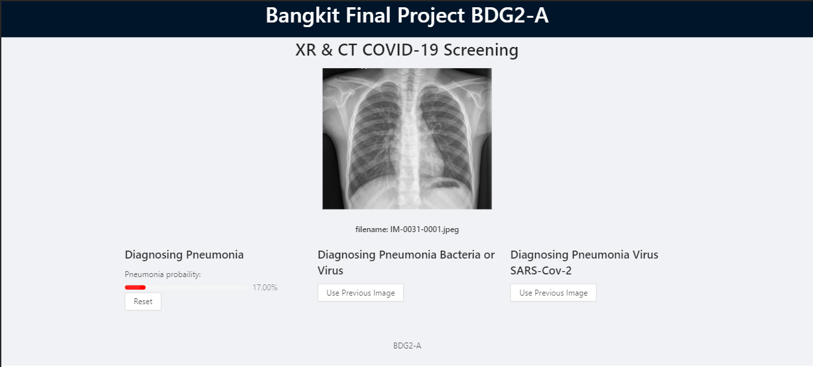
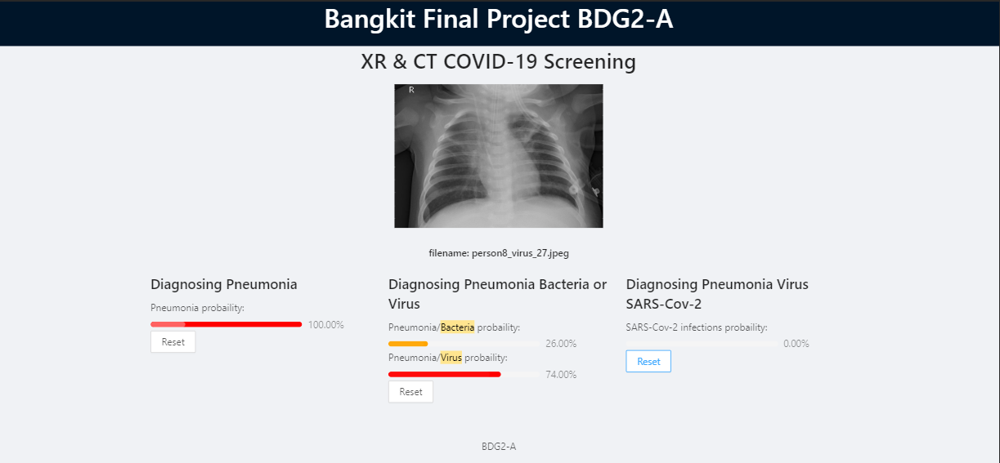
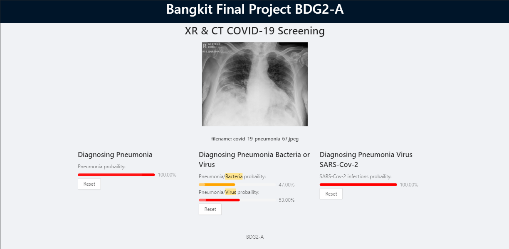

# Bangkit Final Project | BDG2-A
[](https://app.netlify.com/sites/bangkit-bdg2a/deploys)

Detecting COVID-19 in CT or X-ray images with Tensorflow. 

## About Bangk!t


[Bangk!t](https://sites.google.com/view/bangkitacademy?pli=1) is a Google-led academy developed in collaboration with Gojek, Tokopedia, and Traveloka, designed to produce high-calibre, technical talent for world-class, Indonesian technology companies and startups. 

## Disclaimer
This project about COVID-19 detection is for **educational purposes only**. It is not meant to be a reliable, highly accurate COVID-19 diagnosis system, nor has it been professionally or academically vetted.

## Demo
- Netlify : [https://bangkit-bdg2a.netlify.app/](https://bangkit-bdg2a.netlify.app/)
- Firebase Hosting [https://bangkit-final-project.web.app](https://bangkit-final-project.web.app)

### Screenshots
<center>

> Normal


> Pneumonia / Virus


> Pneumonia / Virus / SARS-Cov-2


</center>

## Dataset
- Joseph Paul Cohen and Paul Morrison and Lan Dao
COVID-19 image data collection, arXiv:2003.11597, 2020
[covid-chestxray-dataset](https://github.com/ieee8023/covid-chestxray-dataset)

- Daniel Kermany and Kang Zhang and Michael Goldbaum
Labeled Optical Coherence Tomography (OCT) and Chest X-Ray Images for Classification, Mendeley Data, v2
[Chest X-Ray Images (Pneumonia)](https://www.kaggle.com/paultimothymooney/chest-xray-pneumonia)

- Morozov, S., Andreychenko, A., Blokhin, I., Vladzymyrskyy, A., Gelezhe, P., Gombolevskiy, V., Gonchar, A., Ledikhova, N., Pavlov, N., Chernina, V. MosMedData: Chest CT Scans with COVID-19 Related Findings, 2020, v. 1.0, link
 [Mosmed COVID-19 CT Scans](https://www.kaggle.com/andrewmvd/mosmed-covid19-ct-scans)

- Zhao, Jinyu and Zhang, Yichen and He, Xuehai and Xie, Pengtao. COVID-CT-Dataset: a CT scan dataset about COVID-19, 2020. arXiv preprint arXiv:[2003.13865](https://arxiv.org/pdf/2003.13865.pdf)
[zhao2020COVID-CT-Dataset](https://github.com/UCSD-AI4H/COVID-CT)

## Models
- [Pneumonia vs Normal](https://github.com/ilmimris/bangkit-bgd2a-pneumonia-vs-normal) 
- [Pneumonia / Bacteria vs Virus](https://github.com/ilmimris/bangkit-bgd2a-bacteria-vs-virus) 
- [Pneumonia / Virus / SARS-Cov-2 vs Others](https://github.com/ilmimris/bangkit-bgd2a-virus-covid-vs-noncovid) 

#### Baseline Architectur and Transfer Learning
We use baseline model `DenseNet` with pretrained weight `imageNet`, then we freze the baseline, cut the last layer, and then we add more layers to work with XR and CT Image COVID19. Why `DenseNet`? `DenseNet` model is small and has high accuracy. 

#### Quantization Technique
In order to make model works on the edge (browser), we convert all weights model from `float32` into `uint8` and support `tfjs`. The result is the model more lightest and faster to make prediction than before quatization. 

#### Convertion Tool 
We use `tensorflowjs_converter`. Install with:
```shell
pip install tensorflowjs
```
Do convertion with: 
```shell
tensorflowjs_converter --input_format keras --quantize_uint8  ./model.h5 ./tfjs.uint8
```

## Web Apps
This web application built using [`React`](https://reactjs.org/), styling with [`antd`](http://antd.design/), do machine learning thing with [`@tensorflow/tfjs`](https://www.npmjs.com/package/@tensorflow/tfjs), and use webgl backend with [`@tensorflow/tfjs-backend-webgl`](https://www.npmjs.com/package/@tensorflow/tfjs-backend-webgl). 

This web application has been optimized, and will load model and save it into your browser. When your refresh the browser, the app does not need to refetch the model from server.

#### Bootstraping Web App on Your Local Machine

**Requirements** :
- [nodejs v12.18.1](https://nodejs.org/en/download/)
- [yarn](https://yarnpkg.com/getting-started/install/) 


Clone this repo into your machine:
```shell
git clone https://github.com/ilmimris/bangkit-bgd2a-webapp
```

Open the directory `bangkit-bdg2a-webapp`:
```shell
cd bangkit-bdg2a-webapp
```

Install all the dependencies:
```shell
npm install
```

Start the web app:
```shell
npm start
```

Open [http://localhost:3000](http://localhost:3000) in your browser. *(Chrome is recommended)*

## Deploy Apps
### Self Hosting
Build this project:
```shell
npm run build
```

Upload `build` directory into your hosting root directory such as `public_html/`. 

### Firebase Hosting
Build this project:
```shell
npm run build
```
Deploy to firebase:
```shell
firebase deploy
```

## Contributors
- Muhammad Rafiul Ilmi Syarifudin ([ilmimris](https://github.com/ilmimris)) :sparkles: 
- Gabriel Daely ([daeIy](https://github.com/daeIy))
- Suparjo Tamin ([suparjotamin](https://github.com/suparjotamin))
- Noer Ni'mat Syamsul Kabir ([NoerNikmat](https://github.com/NoerNikmat))

## License
This project is licensed under the terms of the MIT license.